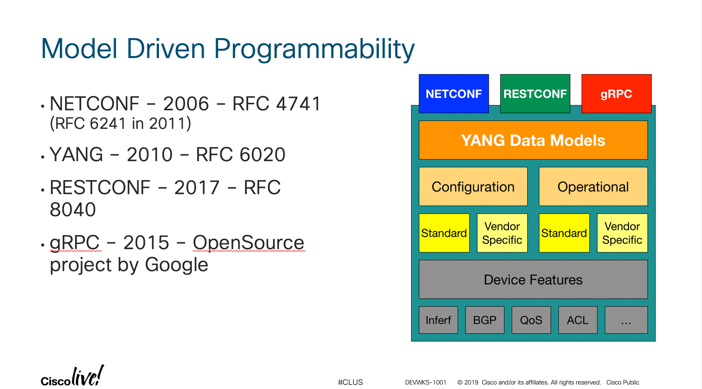
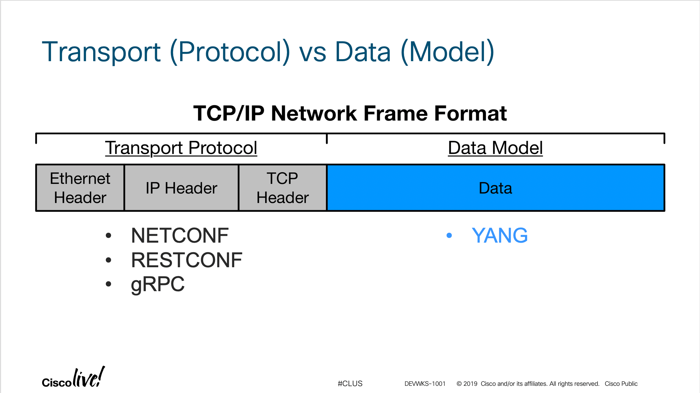

## Introduction to Model Driven Programmability

The road to model driven programmability may seem to be a relatively new concept but in reality this journey started more than a decade ago. The idea grew out of the need to create a methodology to for configuration and operation of network devices. 

Now you may be asking yourself "Isn't this what SNMP was supposed to provide?" The short answer is 'yes' but when one considers the challenges with a consistent delivery of MIBs from the various networking vendors the standards bodies quickly realized there has to be a better way.

What was ultimately delivered over the next decade was a series of standards that defined how an operator could interact with a network device. At the highest level rather than configuring a device in model specific language an operator writes their configuration to a representative model (YANG) resident on the device. They interact with the device through a standards based management protocol. In this lab we will be focusing on the NETCONF protocol.

Before we jump into NETCONF and YANG it's important to understand their relationship. YANG is nothing more than a representation of data on a network device. YANG doesn't 'do' anything. In order to interact with YANG an operator must use a transport protocol (NETCONF/RESTCONF/gRPC) to interact with the data on the remote device.

With this in mind let's take a look at what is a data model and what types of thinks we can model with YANG.

## [Module 1: Exploring YANG Models](DEVWKS_1001_Self_3.md)
## [Return to the Table of Contents](../../README.md)
 