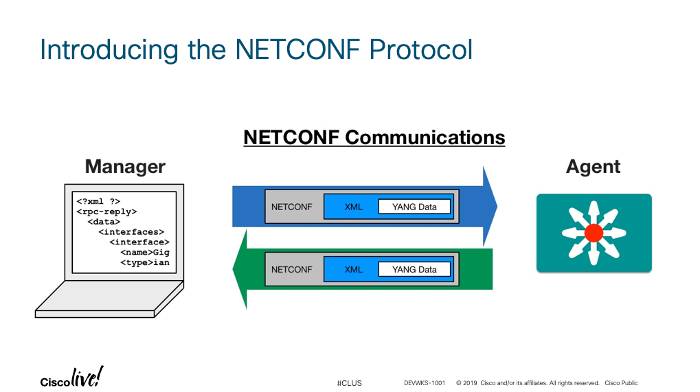

## Introduction to NETCONF

NETCONF (Network Configuration) was originally developed and published as RFC 4741 in 2006 and revised as RFC 6241 in 2011. NETCONF has become the de facto network management protocol for model driven programmability. The protocol defines a simple mechanism for managing a network device, retrieving configuration data from a network device, uploading new configuration data to a network device, and manipulating configuration data on a network device.

NETCONF does not define the data, that is the job of YANG. NETCONF defines the mechanism for communicating with a network device.

The NETCONF network management protocol is a client-server model using remote procedure call (RPC) over a secure connection-oriented session. The client sends the RPC encoded in XML, and the server replies with a response encoded in XML. The client RPC and server response are typically YANG data models and YANG data, encoded in an XML data format. The most common transport protocol used to secure NETCONF connections is typically SSH. The NETCONF protocol stack and relationship to SSH and YANG can be represented as follows:

- Transport Layer - NETCONF uses a secure TCP/IP transport protocol, for example SSH as detailed in [RFC 6242] (https://tools.ietf.org/html/rfc6242).
- Messages Layer - NETCONF encodes all communication in XML sent with remote procedure call (RPC).
- Operations Layer - NETCONF messages are sent as operations, which are specific actions to take. NETCONF operations will be covered in more detail later in this lab.
- Content Layer - This is the configuration and operational data from the network device, YANG data, to be exact.

In the NETCONF protocol, the client is referred to as the manager and the server is referred to as the agent.
The manager is you, or your workstation or network management system. The agent is the network device you manage.
Here is another way to visually represent the NETCONF protocol stack and client-server relationship of the NETCONF manager and agent:

The NETCONF protocol provides a set of actions called operations that are used to retrieve device operational information and manage device configuration. Not all operations are supported by an agent and RPC replies should be checked for errors responses. Here is a brief introduction to the common protocol operations you should be familiar with to get started:

The <get> NETCONF operation is used to retrieve the running configuration and operational state from a network device.

The <get-config> NETCONF operation is used to retrieve all or a subset of a specific configuration from a network device.

The <edit-config> NETCONF operation is used to load all or a subset of a specific configuration to the target datastore on a network device. The device will analyze the source and target configuration and make only the necessary changes to the target configuration. The target configuration is not necessarily replaced, allowing you to make configuration changes without deleting the configuration first, effectively merging changes in configuration.

The <copy-config> NETCONF operation is used to create or replace the entire target configuration datastore with a specific source datastore. If the target datastore exists, then the target datastore will be overwritten.

The <delete-config> NETCONF operation is used to delete the entire target configuration datastore (however, the <running> datastore cannot be deleted).

The lock and unlock NETCONF operations are used to lock or unlock a configuration datastore, preventing other CLI, SNMP, or NETCONF sessions from making configuration changes while locked.

The <close-session> NETCONF operation is used to terminate a NETCONF session gracefully.

The <kill-session> NETCONF operation is used to terminate a NETCONF session forcefully. All active operations are aborted, all locks are resources are released, and the NETCONF session is closed.

A NETCONF datastore is a place on the NETCONF agent, or network device, that contains the configuration and operational state data. A NETCONF configuration datastore is a datastore that contains the necessary configuration to make the network device operational. Every NETCONF operation must specify a target datastore. The <running> configuration datastore is the only mandatory datastore specified by the NETCONF Internet Standard. However, other datastores may be supported by the network device vendor.

With that let's get some hands on with NETCONF.

## [Working with NETCONF](DEVWKS_1001_Self_6.md)
## [Return to the Table of Contents](../../README.md)

#### Special Thanks to Curtis Smith for letting me *borrow* his explanion of NETCONF. Check out his [github repo](http://github.com/curtissmith).
