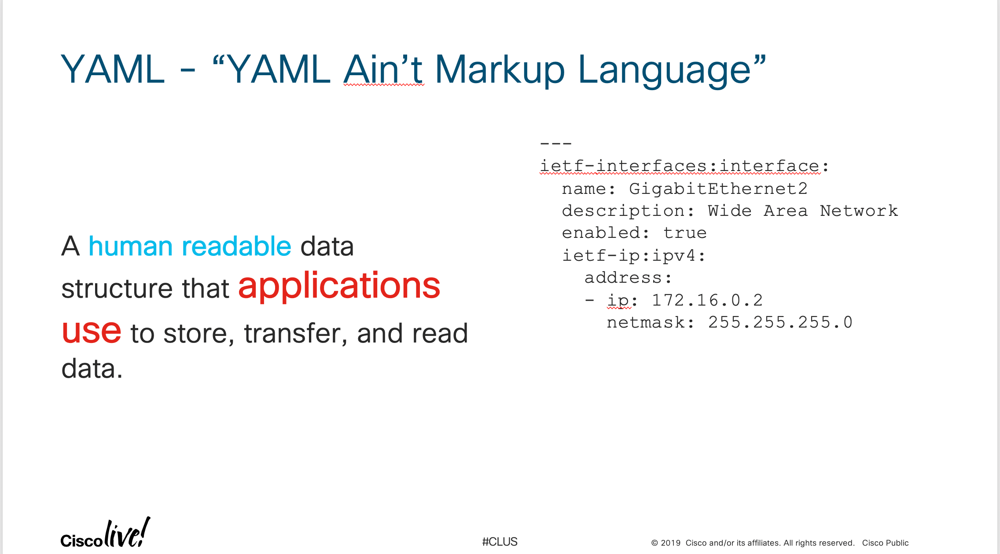

## Module 1: Introduction to YAML

YAML ("YAML Ain't Markup Language") is a human-readable data-serialization language. It is commonly used for configuration files, but could be used in many applications where data is being stored (e.g. debugging output) or transmitted (e.g. document headers). [1](https://en.wikipedia.org/wiki/YAML). It's indention-based markup language aims to be both easy to read and easy to write. YAML shares many similarities with JSON.



The core component of YAML is a scalar. They represent ordinary values such as numbers, strings, and booleans. These values are grouped into lists and dictionaries. 

A list is a collection of elements. Every element is indented and starts with a dash and a space. **DO NOT USE TABS**:

```
space_missions:
 - Mercury Program
 - Gemini Program
 - Apollo Program
 - Skylab
 - Space Shuttle
```

A dictionary is a collection of key:value mappings. The keys are case-sensitive. They are indented with a space and must contain a space after the :. **DO NOT USE TABS**:

```
space_mission:
 name: Mercury
 start_date: 1959
 end_date: 1963
 total_missions: 6
```

Dictionaries can be nested in lists (and vice versa) to create more complex data structures:

```
foo_fighters:
 - name: Dave Grohl
   instrument: guitar
 - name: Nate Mandel
   instrument: bass
 - name: Pat Smear
   instrument: guitar
 - name: Taylor Hawkins
   instrument: drums
 - name: Chris Shifflett
   instrument: guitar
 - name: Rami Jaffee
   instrument: keyboards
```

With this understanding lets look at an example of YAML in code.


## [Module 1 Exercise: Working with YAML Data](DEVWKS_1512_3.md)
## [Return to the Table of Contents](../../README.md)
 