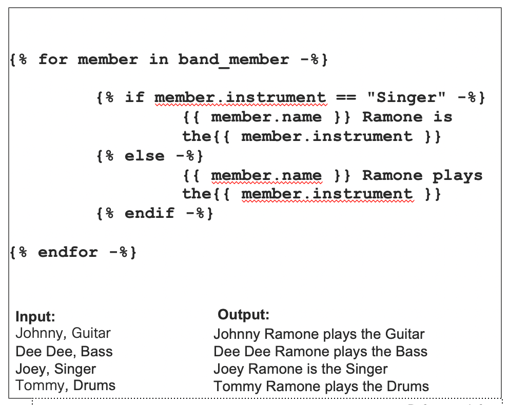

## Module 2: Jinja Templating

Jinja2 is one of the most used template engines for Python. It is inspired by Django's templating system but extends it with an expressive language that gives template authors a more powerful set of tools such as loops and conditionals.

You can find more information on Jinja [here](http://jinja.pocoo.org).

Before we start the exercises let's consider the following Jinja template that will take an input of a name and the instrument they play and output the members of the Ramones and what role they played in the band (besides being absolutely amazing).

Let's step through what's contained.

- Variables and/or logic are placed between delimiters
 -  - Used for expressions or loops. 
		- ‘-%}’ – Removes additional white space.

 - {{ …. }} – Used for outputting the expression or variable.
- Loops
	- Opened with  and typically fed in from some form of programmatic script.
	- Closed with 
- Conditionals
	- Can be nested in other operations
if, elif, else options (ex: 
	- Closed with 

Let's take a look at some examples in code.

## [Module 2 Exercises : Working with Jinja Templating](DEVWKS_1512_5.md)
## [Return to the Table of Contents](../../README.md)
