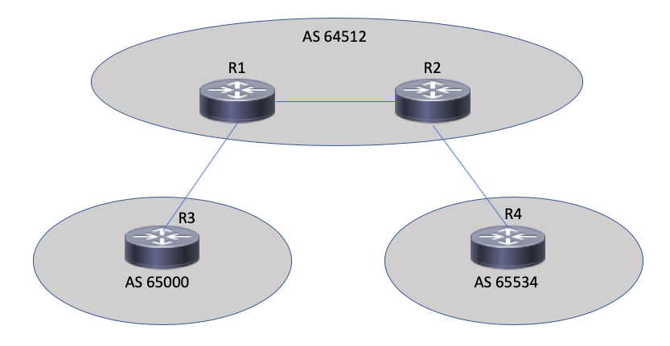

## Module 3: Pulling it All Together

This module is designed to be more of a demo than an actual hands on lab. The set is as follows:



In this exercise we will be configuring the BGP peering between these four routers. Some notes on what the configuration should include.

- All EBGP peerings will be done on physical interfaces.
- All IBGP peerings will be done between loopback interfaces.
- All BGP peerings should be configured for inbound soft reconfiguration.
- All BGP peerings should have both an inbound and outbound route-map configured.
	- The naming convention for the route map should include the router originating the advertisement and the route receiving the advertisement. 

Based on the requirements a couple of things should immediately come to mind.

- By nature of there being 4 routers we will need some type of loop. To simplify the template we will use a combination of a Python loop and a Jinja loop.
- Based on the difference in peering interface for IBGP and EBGP we will need a conditional statement.

Before we get started I understand that the majority of this challenge could be accomplished with a BGP peer group. Let's, for a moment, picture a world where peer-groups didn't exist :).

Let's start by taking a look at our python code:

```
cat jinja_yaml_bgp.py
```

```
from jinja2 import Template
import yaml

print("Reading in Device Device Details")
with open("jinja_yaml_bgp.yaml") as f:
    device_details = yaml.safe_load(f.read())

with open("jinja_yaml_bgp.j2") as f:
    template_in = Template(f.read())

for device in device_details["devices"]:
    print("***** Generating Configuration for: {} *****".format(device["name"]))
    template_out = template_in.render(name=device["name"],asn=device["asn"], rid=device["rid"], neighbor=device["neighbor"])

    print(template_out)
```

Our code is pretty simple. In fact most of the complexity will be in the Jinja template. Our tasks are consistent with our other examples.

1. Load in the device details from the YAML file
2. Read in the Jinja Template
3. Render the template with defined variables.
	- In this case rather than writing two loops in the Jinja template we will leverage a Python loop to run the rendering on each router in the YAML details (for device in device_details["devices'}
	- Pay particular attention to how the variables are being defined. Because we are using a structured input we can extract specific details for creating the directional route-map names.
4. Process the output.

Let's take a look at a portion of the YAML data

```
cat jinja_yaml_bgp.yaml
```

The output:

```
devices:
  - name: R1
    asn: 64512
    rid: 1.1.1.1
    neighbor:
      - peer_rtr: R3
        peer_type: ebgp
        peer_addr: 10.13.13.2
        peer_asn: 65000
        local_int: GigabitEthernet1
      - peer_rtr: R4
        peer_type: ebgp
        peer_addr: 10.14.14.2
        peer_asn: 65534
        local_int: GigabitEthernet3
      - peer_rtr: R2
        peer_type: ibgp
        peer_addr: 10.12.12.2
        peer_asn: 64512
        local_int: Loopback0
  - name: R2
    asn: 64512
    rid: 2.2.2.2
    neighbor:
      - peer_rtr: R3
        peer_type: ebgp
        peer_addr: 10.13.13.2
        peer_asn: 65000
        local_int: GigabitEthernet1
      - peer_rtr: R4
        peer_type: ebgp
        peer_addr: 10.14.14.2
        peer_asn: 65534
        local_int: GigabitEthernet3
      - peer_rtr: R1
        peer_type: ibgp
        peer_addr: 10.12.12.1
        peer_asn: 64512
        local_int: Loopback100
        
```

Read through the data and see if you can identify all the various dictionaries and lists.

Now let's look at the template

```
cat jinja_yaml_bgp.j2
```

The output:

```
router bgp {{ asn }}
bgp router-id {{ rid }}
bgp log-neighbor-changes


neighbor {{ peer.peer_addr }} remote-as {{ peer.peer_asn }}
neighbor {{ peer.peer_addr }} update-source {{ peer.local_int }}

neighbor {{ peer.peer_addr }} remote-as {{ peer.peer_asn }}


!
address-family ipv4
redistribute connected route-map CON2BGP

neighbor {{ peer.peer_addr }} activate
neighbor {{ peer.peer_addr }} soft-reconfiguration inbound
neighbor {{ peer.peer_addr }} route-map FROM_{{ name }}_to_{{ peer.peer_rtr }} out
neighbor {{ peer.peer_addr }} route-map FROM_{{ peer.peer_rtr }}_to_{{ name }} in

exit-address-family
```

As a note on the template. Because we use Python to loop through the devices in the YAML file the only loop we are required to configure is for iterating through all the peer routers.

Finally let's exectue the code:

```
python jinja_yaml_bgp.py
```

To view the output click below:

<details><summary>CLICK ME</summary>
<p>

```
Reading in Device Device Details
***** Generating Configuration for: R1 *****

router bgp 64512
bgp router-id 1.1.1.1
bgp log-neighbor-changes
neighbor 10.13.13.2 remote-as 65000
neighbor 10.14.14.2 remote-as 65534
neighbor 10.12.12.2 remote-as 64512
neighbor 10.12.12.2 update-source Loopback0
!
address-family ipv4
redistribute connected route-map CON2BGP
neighbor 10.13.13.2 activate
neighbor 10.13.13.2 soft-reconfiguration inbound
neighbor 10.13.13.2 route-map FROM_R1_to_R3 out
neighbor 10.13.13.2 route-map FROM_R3_to_R1 in
neighbor 10.14.14.2 activate
neighbor 10.14.14.2 soft-reconfiguration inbound
neighbor 10.14.14.2 route-map FROM_R1_to_R4 out
neighbor 10.14.14.2 route-map FROM_R4_to_R1 in
neighbor 10.12.12.2 activate
neighbor 10.12.12.2 soft-reconfiguration inbound
neighbor 10.12.12.2 route-map FROM_R1_to_R2 out
neighbor 10.12.12.2 route-map FROM_R2_to_R1 in
exit-address-family

***** Generating Configuration for: R2 *****

router bgp 64512
bgp router-id 2.2.2.2
bgp log-neighbor-changes
neighbor 10.13.13.2 remote-as 65000
neighbor 10.14.14.2 remote-as 65534
neighbor 10.12.12.1 remote-as 64512
neighbor 10.12.12.1 update-source Loopback100
!
address-family ipv4
redistribute connected route-map CON2BGP
neighbor 10.13.13.2 activate
neighbor 10.13.13.2 soft-reconfiguration inbound
neighbor 10.13.13.2 route-map FROM_R2_to_R3 out
neighbor 10.13.13.2 route-map FROM_R3_to_R2 in
neighbor 10.14.14.2 activate
neighbor 10.14.14.2 soft-reconfiguration inbound
neighbor 10.14.14.2 route-map FROM_R2_to_R4 out
neighbor 10.14.14.2 route-map FROM_R4_to_R2 in
neighbor 10.12.12.1 activate
neighbor 10.12.12.1 soft-reconfiguration inbound
neighbor 10.12.12.1 route-map FROM_R2_to_R1 out
neighbor 10.12.12.1 route-map FROM_R1_to_R2 in
exit-address-family

***** Generating Configuration for: R3 *****

router bgp 65000
bgp router-id 3.3.3.3
bgp log-neighbor-changes
neighbor 10.13.13.1 remote-as 64512
neighbor 10.23.23.1 remote-as 64512
!
address-family ipv4
redistribute connected route-map CON2BGP
neighbor 10.13.13.1 activate
neighbor 10.13.13.1 soft-reconfiguration inbound
neighbor 10.13.13.1 route-map FROM_R3_to_R1 out
neighbor 10.13.13.1 route-map FROM_R1_to_R3 in
neighbor 10.23.23.1 activate
neighbor 10.23.23.1 soft-reconfiguration inbound
neighbor 10.23.23.1 route-map FROM_R3_to_R2 out
neighbor 10.23.23.1 route-map FROM_R2_to_R3 in
exit-address-family

***** Generating Configuration for: R4 *****

router bgp 65534
bgp router-id 4.4.4.4
bgp log-neighbor-changes
neighbor 10.14.14.1 remote-as 64512
neighbor 10.24.24.1 remote-as 64512
!
address-family ipv4
redistribute connected route-map CON2BGP
neighbor 10.14.14.1 activate
neighbor 10.14.14.1 soft-reconfiguration inbound
neighbor 10.14.14.1 route-map FROM_R4_to_R1 out
neighbor 10.14.14.1 route-map FROM_R1_to_R4 in
neighbor 10.24.24.1 activate
neighbor 10.24.24.1 soft-reconfiguration inbound
neighbor 10.24.24.1 route-map FROM_R4_to_R2 out
neighbor 10.24.24.1 route-map FROM_R2_to_R4 in
exit-address-family
```

</p>
</details>

We now have fully reusable code. Should you choose you can go in and modify the YAML file to change up the peer address, router names, add or remove devices, etc. and we can use the same Python and Jinja to generate new BGP configurations.

## [Wrap Up](DEVWKS_1512_7.md)
## [Return to the Table of Contents](../../README.md)