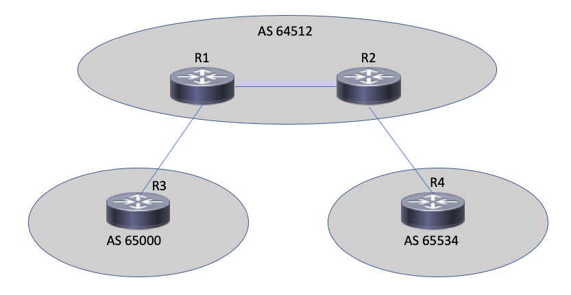

## Module 3: Building BGP Configs with Jinja and YAML

#### Task 1: Quick Look at the Topology




#### Task 2: Inspecting the Python

Inspect the Python:

```
cat jinja_yaml_bgp.py
```

Inspect the YAML:

```
cat jinja_yaml_bgp.yaml
```

Inspect the Jinja:

```
cat jinja_yaml_bgp.j2
```

Execute the Python:

```
python jinja_yaml_bgp.py
```

## [Moving On to the Wrap Up!](DEVWKS_1512_Guided_5.md)
## [Return to the Table of Contents](../../README.md)